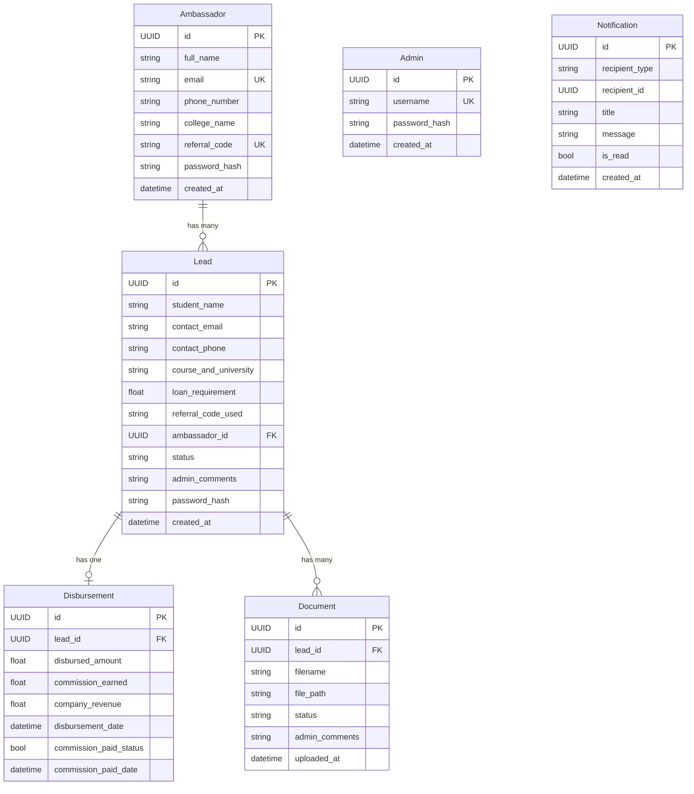

# FinConnect Axis — Education Loan Lead & Referral Network Platform
## Complete Implementation & Website Design Summary

> **Product**: FinConnect Axis — A platform that lets parents split school/education fees into 10 monthly installments, powered by a Campus Ambassador referral network.

---

## 1. Technology Stack

| Layer | Technology | Purpose |
|:------|:-----------|:--------|
| **Frontend** | Next.js (React + TypeScript) | UI, routing, SSR/SSG |
| **Styling** | TailwindCSS | Utility-first responsive design |
| **Backend** | Python FastAPI | REST API, business logic |
| **ORM** | SQLModel (SQLAlchemy) | Database models & queries |
| **Database** | SQLite (dev) → PostgreSQL (prod) | Data persistence |
| **Auth** | Argon2 (passlib) | Password hashing |
| **Icons** | Lucide React | UI iconography |
| **API Client** | Custom `fetchApi` utility | Centralized API calls with timeout |

---

## 2. Database Schema (6 Tables)



**Lead Status Flow**: `Pending` → `Processing` → `Approved` → `Disbursed` (or `Rejected` at any stage)

---

## 3. Backend API (FastAPI) — 7 Router Modules

### 3.1 Leads Router (`/api/leads`)

| Endpoint | Method | Description |
|:---------|:-------|:------------|
| `/api/leads/` | POST | Create lead with **auto-tagging** — if `referral_code` matches an ambassador, the lead is linked to them; otherwise flagged as organic/direct. Sends notifications to admin and ambassador. |
| `/api/leads/{id}` | PATCH | Update lead status/comments. Blocks setting status to "Disbursed" (must use disburse endpoint). |
| `/api/leads/{id}/disburse` | POST | Disburse a loan — calculates commission breakdown, creates `Disbursement` record, notifies ambassador and student. |

**Commission Engine** (in `config.py`):
- **Bank Commission Rate**: 1% of disbursed amount (total admin profit)
- **Ambassador Commission**: 0.3% of disbursed amount
- **Company Net Revenue**: 0.7% of disbursed amount (1% − 0.3%)

### 3.2 Auth Router (`/api/auth`)

| Endpoint | Method | Description |
|:---------|:-------|:------------|
| `/api/auth/ambassador/login` | POST | Email + password login, returns ambassador ID |
| `/api/auth/student/login` | POST | Email + password login (default password `123456` on first login, auto-hashed) |
| `/api/auth/admin/login` | POST | Username + password login, returns UUID token |
| `/api/auth/ambassador/register-password` | POST | Set/update ambassador password by email |

**Auth mechanism**: Admin UUID token in `Authorization: Bearer` header. Ambassador/student sessions stored in `localStorage`.

### 3.3 Ambassadors Router (`/api/ambassadors`)

| Endpoint | Method | Description |
|:---------|:-------|:------------|
| `/api/ambassadors/` | POST | Register new ambassador (full_name, email, phone, college, referral_code, password). Validates unique email & code. |
| `/api/ambassadors/{id}` | GET | Retrieve ambassador details |

### 3.4 Analytics Router (`/api/analytics`)

| Endpoint | Method | Description |
|:---------|:-------|:------------|
| `/api/analytics/ambassadors/{id}/performance` | GET | Ambassador dashboard data: total leads, status breakdown, paid/pending commission, tier calculation (Bronze/Silver/Gold), recent leads |
| `/api/analytics/admin/performance` | GET | 🔒 Admin-only. Global stats: total ambassadors, leads, status breakdown, financials (disbursed, revenue, commission) |
| `/api/analytics/admin/leads` | GET | 🔒 Admin-only. All leads with ambassador name and disbursement details |
| `/api/analytics/admin/ambassadors` | GET | 🔒 Admin-only. All ambassadors with lead counts and total earnings (batch queries) |
| `/api/analytics/leaderboard` | GET | Top 5 ambassadors by lead count (public) |

**Ambassador Tier System**:
- **Bronze**: 0–9 leads
- **Silver**: 10–49 leads
- **Gold**: 50+ leads

### 3.5 Admin Router (`/api/admin`)

| Endpoint | Method | Description |
|:---------|:-------|:------------|
| `/api/admin/payouts` | GET | 🔒 All disbursements with ambassador/lead details |
| `/api/admin/payouts/{id}/pay` | POST | 🔒 Mark commission as paid, notifies ambassador |

### 3.6 Documents Router (`/api/documents`)

| Endpoint | Method | Description |
|:---------|:-------|:------------|
| `/api/documents/upload` | POST | Upload document (multipart form), links to lead, notifies admin |
| `/api/documents/{lead_id}` | GET | List documents for a lead |
| `/api/documents/file/{doc_id}` | GET | Download/view a specific document file |
| `/api/documents/lead/{lead_id}` | GET | Get lead status with disbursement details (used by student dashboard) |
| `/api/documents/{doc_id}/verify` | PATCH | Verify or reject a document, notifies student |

### 3.7 Notifications Router (`/api/notifications`)

| Endpoint | Method | Description |
|:---------|:-------|:------------|
| `/api/notifications/` | GET | Fetch notifications by `recipient_type` and optional `recipient_id` |
| `/api/notifications/{id}/read` | PUT | Mark notification as read |

**Notification triggers**: New lead → admin & ambassador; Disbursement → ambassador & student; Document upload → admin; Document verify/reject → student; Commission paid → ambassador.

---

## 4. Frontend (Next.js) — Website Design & Pages

### 4.1 Site Map & Route Architecture

```
/                          → Landing Page (Hero + Features)
/apply                     → Student Loan Application Form
/apply?ref=CODE123         → Application with auto-populated referral code
/eligibility               → Credit Eligibility Calculator
│
├── /student/
│   ├── login              → Student Login (email + password)
│   └── dashboard          → Student Dashboard (status stepper, docs, disbursement card)
│
├── /ambassador/
│   ├── login              → Ambassador Login
│   └── register           → Ambassador Registration
│
├── /dashboard/
│   └── [id]/              → Ambassador Dashboard (stats, referral link, leaderboard)
│       ├── add-lead       → Manual Lead Addition Form
│       └── resources      → Ambassador Resources Page
│
└── /admin/
    ├── login              → Admin Login (username + password)
    └── (dashboard)        → Admin Portal (4-tab dashboard)
```

### 4.2 Page-by-Page Design Details

#### 🏠 Landing Page (`/`)

| Section | Design |
|:--------|:-------|
| **Hero** | Split layout — left: headline ("Split school fees in 10 parts with FinConnect Axis"), description, CTA buttons ("Switch to FinConnect Axis" blue, "Ambassador Login" light blue), secondary links (Student Portal, Eligibility Check, Admin Access). Right: full-bleed education stock image. |
| **Features** | 4-card grid: Flexible Payments (CreditCard icon), No Extra Fees (DollarSign), 10-Minute Onboarding (Zap), Buyer Protection (ShieldCheck). Cards with blue icon circles, hover shadow transition. |
| **Color palette** | Primary: `blue-900`, accents: `blue-600`, `green-600`, backgrounds: `slate-50`, `white` |

#### 📝 Application Form (`/apply`)

- Centered max-width card with shadow
- Fields: Full Name, Email, Phone, Course & University, Loan Requirement (INR), Referral Code (optional, auto-filled from URL `?ref=`)
- Submit → POST `/api/leads/` → auto-login → redirect to student dashboard
- Success state: green check icon card with spinning redirect indicator
- Error state: red alert with icon

#### ⚡ Eligibility Calculator (`/eligibility`)

Client-side credit check with 4 inputs:
1. **CIBIL Score** (300–900, requirement: >700)
2. **Co-applicant Monthly Income** (₹)
3. **Co-applicant Existing EMIs** (₹)
4. **Past Loan Settlements** (Yes/No)

**Logic**: FOIR = (EMIs / Income) × 100. Eligible if: CIBIL > 700 + No settlements + FOIR < 50%. Result shows "High" (green) or "Low" (red) probability with reasons.

#### 🎓 Student Dashboard (`/student/dashboard`)

- **Nav bar**: Home button, "Student Portal" title, welcome message, notification bell, logout
- **Status Stepper**: 4-step visual progress bar (Registered → Processing → Approved → Disbursed) with animated green progress line. Rejected state shows red alert card.
- **Details**: Course, Loan Requirement, Admin Comments (yellow highlight)
- **Disbursement Card** (shown when status = Disbursed): Green gradient card with Banknote icon, amount, date, and "15-20 business days" deposit timeline info box
- **Documents Section**: File list with upload button; document upload goes to `/api/documents/upload`

#### 🤝 Ambassador Dashboard (`/dashboard/[id]`)

- **Nav bar**: Home, "Ambassador Portal", notification bell, logout
- **Referral Link**: Read-only input showing unique URL (`/apply?ref=CODE`), copy button with success animation, "Add Lead" and "Resources" action buttons
- **Tier Progress**: Gradient card (indigo → purple) showing current tier (Bronze/Silver/Gold), progress bar to next tier with percentage
- **Stats Grid**: 4 cards — Total Leads, Paid Earnings (green), Pending Payouts (yellow), Disbursed Leads
- **Recent Leads Table**: Student name, status badge (color-coded), date
- **Leaderboard**: Top 5 ambassadors ranked by leads with medal-colored badges (#1 gold, #2 silver, #3 bronze)
- **Loading state**: Skeleton UI placeholders

#### 🛡️ Admin Portal (`/admin`)

**4-tab navigation**: Overview | All Leads | Ambassadors | Payouts

| Tab | Content |
|:----|:--------|
| **Overview** | 4 stat cards (Total Ambassadors, Total Leads, Disbursed Loans, Total Revenue) with colored left borders. Financial Performance panel: Total Disbursed, Commission Paid, Net Revenue. |
| **All Leads** | Searchable/filterable table — Student name (avatar initial), Course + loan amount, Referral (ambassador name + code), Status (color badge), Date. Actions: Edit (modal), View Docs (modal). |
| **Ambassadors** | Searchable table — Name + email, College, Referral Code (blue badge), Leads count, Earnings (green). |
| **Payouts** | Table with sticky header — Ambassador, Lead, Loan Amount, Profit (1%), Commission (0.3%), Net Revenue, Status (Paid/Pending badge), Date, "Mark Paid" action button. |

**Lead Edit Modal**: Status dropdown (Pending/Processing/Approved/Rejected/Disbursed), disbursed amount input (shows live commission preview: 1% profit, 0.3% ambassador, 0.7% net), admin comments textarea.

**Document Viewer Modal**: File list with filename, upload date, status badge, View/Verify/Reject buttons.

#### 🔐 Login/Register Pages

- **Admin Login**: Username + password form, indigo theme
- **Ambassador Login**: Email + password with Mail/Key icons, rounded-2xl card with shadow-xl, link to register
- **Ambassador Register**: 6-field form (name, email, phone, college, referral code, password), redirects to login on success
- **Student Login**: Email + password, blue theme, hint about default password

### 4.3 Shared Components

| Component | Description |
|:----------|:------------|
| `NotificationCenter` | Bell icon with unread badge (red dot), dropdown panel with notification list, click-to-mark-read, polls every 30 seconds. Used across all 3 dashboards. |
| `LeadForm` | Reusable application form with URL param parsing for referral code |
| `Hero` | Landing page hero section |
| `Features` | Feature showcase grid |

### 4.4 API Client (`lib/api.ts`)

Centralized fetch wrapper with:
- Base URL from `NEXT_PUBLIC_API_URL` env variable (default: `http://localhost:8000`)
- 15-second timeout with `AbortController`
- Auto JSON content-type headers
- Error extraction from API response `detail` field
- Typed `api.get()`, `api.post()`, `api.patch()`, `api.delete()` helpers

---

## 5. Notification System (Event-Driven)

| Event | Recipients | Message |
|:------|:-----------|:--------|
| New Lead Created | Admin, Ambassador (if referred) | "New lead from {name}" / "Your referral code was used by {name}" |
| Loan Disbursed | Ambassador, Student | Commission details with 7-day payout timeline / Disbursement amount with 15-20 day deposit timeline |
| Commission Paid | Ambassador | "Commission of ₹{amount} for {student} has been processed" |
| Document Uploaded | Admin | "{student} uploaded {filename}" |
| Document Verified/Rejected | Student | "{filename} was approved ✅ / rejected ❌" |

---

## 6. Deployment Architecture

| Service | Platform | Tier |
|:--------|:---------|:-----|
| Frontend | Vercel | Free (Hobby) |
| Backend | Render / Railway | Free–$7/mo |
| Database | Supabase (PostgreSQL) | Free |
| File Storage | Cloudflare R2 / AWS S3 | Free (10GB) |
| Domain | Namecheap | ~$10/year |
| **Monthly Total** | | **$0–$7** |

**Production TODOs**:
- Migrate file uploads from local disk to S3/R2
- Implement email (Amazon SES) and WhatsApp (Meta Cloud API) notifications
- Add JWT expiration and refresh tokens (current auth is MVP-level)
- Strict CORS, input validation, HTTPS (auto via Vercel/Render)

---

## 7. Current Implementation Status

| Feature | Status |
|:--------|:-------|
| Lead capture & auto-tagging via referral code | ✅ Complete |
| Commission calculation engine (1% / 0.3% / 0.7% split) | ✅ Complete |
| 3-role authentication (Admin, Ambassador, Student) | ✅ Complete (MVP) |
| Ambassador registration with unique referral codes | ✅ Complete |
| Ambassador dashboard with tier system & leaderboard | ✅ Complete |
| Student dashboard with status stepper & document upload | ✅ Complete |
| Admin portal (4-tab: Overview, Leads, Ambassadors, Payouts) | ✅ Complete |
| Disbursement flow with student deposit timeline (15–20 days) | ✅ Complete |
| In-app notification system with polling | ✅ Complete |
| Document upload, view, verify/reject | ✅ Complete |
| Credit eligibility calculator (CIBIL, FOIR, settlements) | ✅ Complete |
| Centralized API client with timeout | ✅ Complete |
| Mobile responsive tables (overflow-x-auto) | ✅ Partial |
| Loading skeleton states | ✅ Ambassador dashboard |
| Email/WhatsApp push notifications | ❌ Not implemented |
| JWT tokens with expiration/refresh | ❌ Not implemented |
| Cloud file storage (S3/R2) | ❌ Not implemented |
| Production database (PostgreSQL) | ❌ Using SQLite locally |
